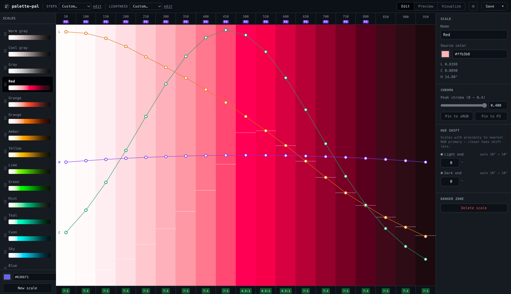

# palette-pal



A color palette generator built with React, Vite, and TypeScript. Create, customize, and export design-token-ready color ramps with WCAG contrast analysis.

## Features

- Generate smooth OKLCH-based color ramps from a source hex color
- Adjustable lightness, chroma, and hue curves per scale
- WCAG 2.1 and APCA contrast badges and full NxN contrast matrix
- Accessible combinations view with filtering by level, polarity, and sort
- Export to W3C DTCG-compatible JSON design tokens
- Export WCAG and APCA contrast maps as compact matrix JSON

## Contrast Map Export Format

Contrast maps use a compact **matrix format**. Each color is listed once in the `colors` array, and `matrix[i][j]` holds the contrast value for `colors[i]` (foreground/text) on `colors[j]` (background). Cells below the minimum threshold are `null`.

### WCAG 2.1

```json
{
  "type": "wcag",
  "colors": [
    { "ramp": "blue", "step": "50", "hex": "#eff6ff" },
    { "ramp": "blue", "step": "500", "hex": "#3b82f6" }
  ],
  "matrix": [[null, 4.52], [4.52, null]],
  "thresholds": { "aa-large": 3, "aa": 4.5, "aaa": 7 }
}
```

- `matrix[i][j]` = WCAG contrast ratio — symmetric (`matrix[i][j] === matrix[j][i]`)
- `null` = ratio below 3:1

### APCA

```json
{
  "type": "apca",
  "colors": [
    { "ramp": "blue", "step": "50", "hex": "#eff6ff" },
    { "ramp": "blue", "step": "500", "hex": "#3b82f6" }
  ],
  "matrix": [[null, -62.3], [58.1, null]],
  "thresholds": { "lc45": 45, "lc60": 60, "lc75": 75 }
}
```

- `matrix[i][j]` = signed Lc value (positive = dark-on-light, negative = light-on-dark)
- **Not symmetric** — APCA is polarity-sensitive
- `null` = |Lc| below 45

### Consuming the matrix

```ts
import data from './contrast-map-wcag.json';
const { colors, matrix, thresholds } = data;

for (let fg = 0; fg < colors.length; fg++) {
  for (let bg = 0; bg < colors.length; bg++) {
    const ratio = matrix[fg][bg];
    if (ratio !== null && ratio >= thresholds.aa) {
      console.log(`${colors[fg].hex} on ${colors[bg].hex} → ${ratio}:1`);
    }
  }
}
```

## Tech Stack

- **React 18 + Vite 5 + TypeScript 5**
- **Tailwind CSS 4** via `@tailwindcss/vite`
- **Zustand 4 + immer** for state management
- **culori** for color math (OKLCH, WCAG contrast)
- **apca-w3** for APCA contrast (Limited W3 License)

## Getting Started

```bash
npm install
npm run dev
```

## Scripts

```bash
npm run dev    # Vite dev server
npm run build  # Production build
npm run lint   # ESLint
```
